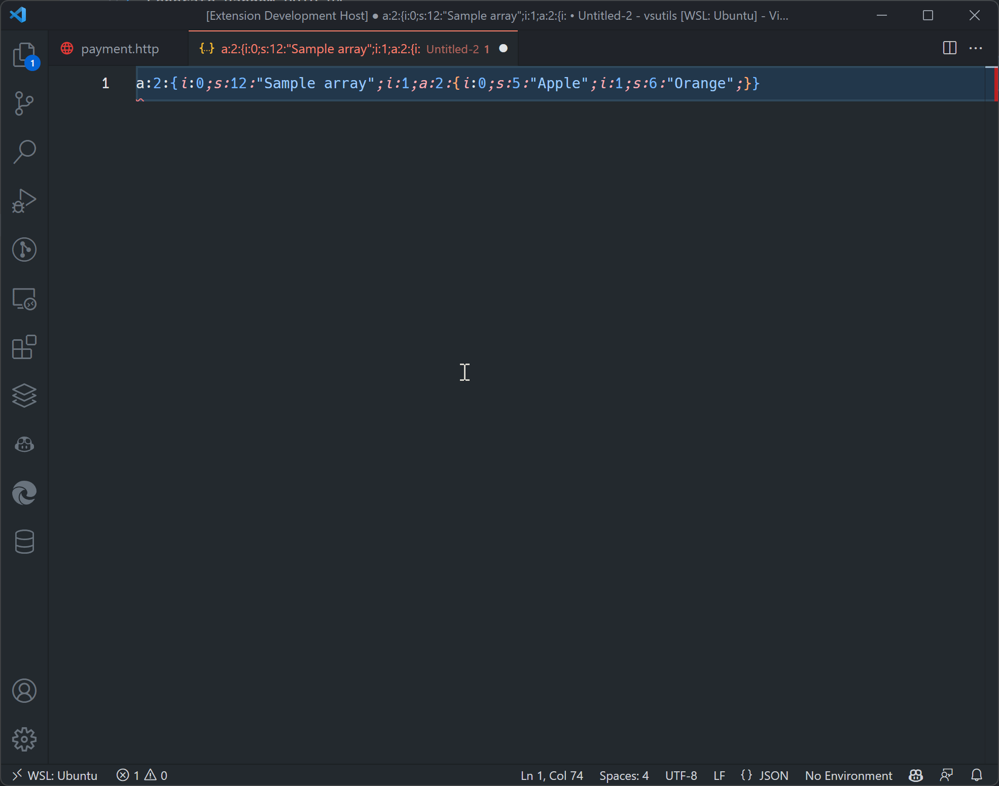

# VS Utils
The missing utilities extension for VS Code. Handling common tasks like encode/decode, serialize, timestamp... without leaving your editor.
No complicated UI, just simple commands.

## Features

- Base64 encode
- Base64 decode
- Current timestamp
- Current date
- Timestamp to date
- Date to Timestamp
- Parse JWT
- Color: Hex to RGB
- Color: RGB to Hex
- PHP Unserialize
- URL Encode
- URL Decode
- Html Encode
- Html Decode
- Html Entities Encode
- Html Entities Decode
- Generate Random UUID v4
- Encrypt as MD5
- Encrypt as SHA1
- Encrypt as SHA256
- Encrypt as SHA512

## Extension Settings
This extension contributes the following settings:

### `vsutils.outputLocation`
Output result location, use the following values:

- `clipboard` copy output to clipboard
- `replace` replace current selection value (or cursor position)
- `newLine` same as next but new line
- `newEditor` new editor

## FAQ

### Will it slow down my VS Code?
No, the extension only runs when you invoke a command.
### How to use?
- Select text
- Press `Ctrl+Shift+P` or `Cmd+Shift+P` to open command palette
- Type `vsutils` and select command

### How to change output location?
- Press Ctrl + , or Cmd + , to open settings
- Search for `vsutils.outputLocation`
- Select your desired output location: `clipboard`, `replace`, `newLine`, `newEditor`

## Release Notes
### 1.0.0
Initial release